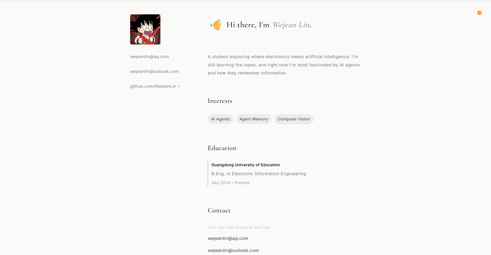
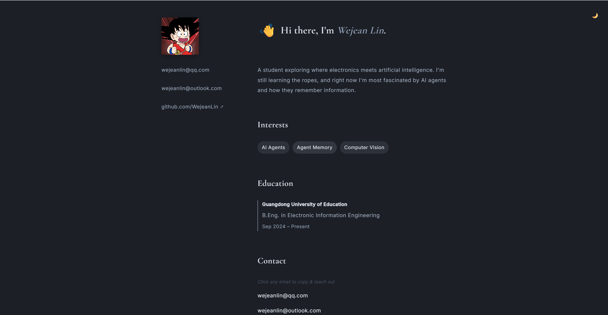

# 🌿 Wejean Lin | Personal Portfolio

<p align="center"><a href="./README-CN.md">中文版</a></p>


<div align="center">

[Live Demo](https://wejeanlin.github.io)

</div>

<p align="center">
  
  
</p>

A minimalist, responsive static personal page built with pure **HTML5 + CSS3 + Vanilla JavaScript**. Designed with a low-saturation Morandi palette, generous whitespace, and refined micro-interactions. Hosted directly on GitHub Pages with zero build tools.

## ✨ Features
- 🎨 **Morandi Color System**: Warm light / deep blue-gray dark mode with smooth CSS variable transitions
- 🌗 **Diagonal Theme Wipe**: GPU-accelerated `clip-path` animation originating from the toggle button
- ✨ **Refined Micro-interactions**: Natural waving emoji, staggered entrance animations, center-expanding underlines
- 📱 **Fully Responsive**: Fluid typography (`clamp()`), adaptive grid/flex layouts, and touch-friendly targets (≥44px)
- 📋 **Smart Clipboard**: One-click email copy with animated toast & auto-dismiss progress bar
- ♿ **Accessibility First**: Semantic HTML, `prefers-reduced-motion` support, WCAG AA contrast ratios, and keyboard navigation

## 🛠️ Tech Stack
| Layer | Technology |
|-------|------------|
| Markup | Semantic HTML5 |
| Styling | CSS3 (Custom Properties, Grid, Flexbox, `@keyframes`, `clip-path`) |
| Logic | Vanilla JavaScript (ES6+, `navigator.clipboard`, requestAnimationFrame) |
| Fonts | `Cormorant Garamond` (Headings) + `Inter` (Body) via Google Fonts |
| Deploy | GitHub Pages (Static) |

## 🚀 Quick Start
1. **Clone or Download** this repository
2. Add your avatar to `assets/avatar.jpg` (recommended: 1:1 ratio, ~400×400px)
3. Open `index.html` in any browser, or serve locally:
   ```bash
   python3 -m http.server 8000
   ```
4. **Deploy to GitHub Pages**: Push to `main` branch → Repo Settings → Pages → Select `/ (root)` → Save.


## 📁 Project Structure
```
/
├── index.html          # Semantic markup & content
├── style.css           # Morandi theme system, responsive layout, animations
├── script.js           # Theme toggle, clipboard, toast logic
└── assets/
    └── avatar.jpg      # Profile image placeholder
```

## 📝 Customization
- **Colors**: Edit CSS variables in `:root` and `[data-theme="dark"]`
- **Typography**: Adjust `--font-title`, `--font-body`, and `clamp()` values in `style.css`
- **Animations**: Tweak `--duration-*` and `@keyframes` for entrance/wave/toast effects
- **Content**: Directly edit text in `index.html` (all strings are in English)

## 📄 License
This project is open for personal and educational use. Feel free to fork, adapt, and build upon it.  
*If you use this template, a star ⭐ or credit is appreciated but not required.*

---
💌 **Contact**: [wejeanlin@outlook.com](mailto:wejeanlin@outlook.com) | [My GitHub](https://github.com/WejeanLin)  


